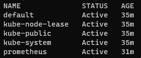
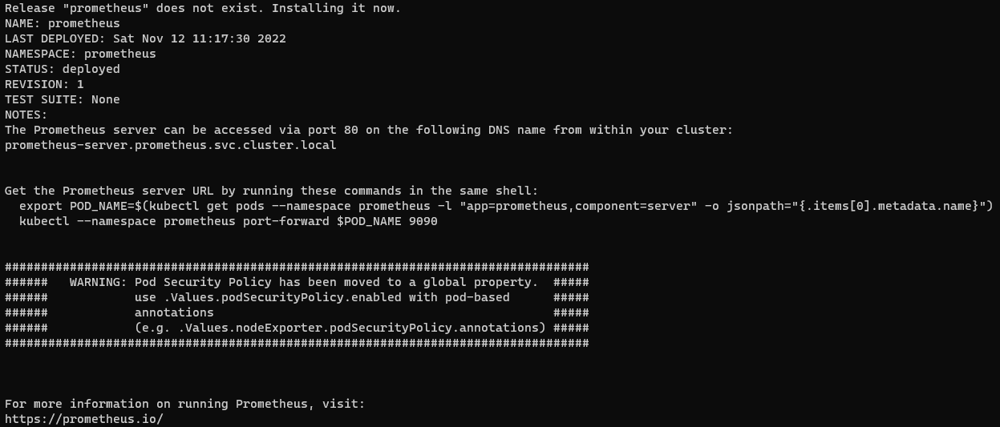
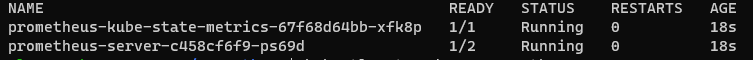
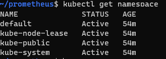

# ЗАДАНИЕ D5.2.3 (HW-03)

1. Создал **namespace** командой - _kubectl create ns prometheus_
- 

2. Создал файл _values.yaml_
```
alertmanager:
  enabled: false

nodeExporter:
  enabled: false

pushgateway:
  enabled: false
```
3. Установил чарт и проверил результат
```
helm upgrade --install --namespace prometheus prometheus prometheus-community/prometheus --values values.yaml
```
- 
```
kubectl get pods -n=prometheus
```
- 

5. Удалил все и проверил
```
helm uninstall -n prometheus promenheus

kubectl get pods -n=prometheus

kubectl delete ns prometheus

kubectl get namespace
```
- 


